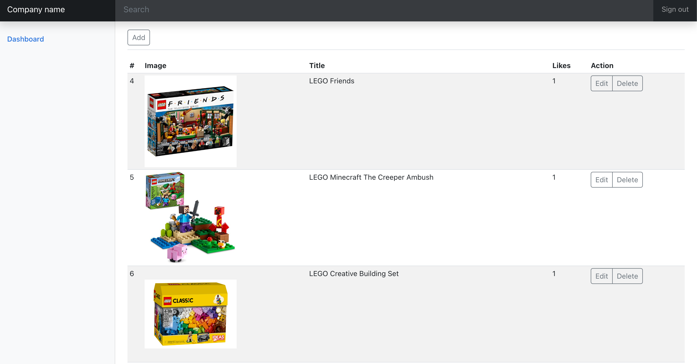

# Microservices Web App

## Project Structure

### Server

The server is made up of two microservices: admin and main. They are deployed using Docker containers.

#### Admin

- Admin Database
  - MySQL
  - Tables: Products, Users
  - Products table synced with main Products table through admin Product ID primary key
  - Maintains admin-level information
- Admin Queue
  - RabbitMQ through CloudAMQP, RabbitMQ as a service
  - Allows for product database syncing between admin and main as well as other MQ operations that allow the microservices to communicate with eachother.
- Admin Backend
  - Python - Django
  - Allows for CRUD operations

#### Main

- Main Database
  - MySQL
  - Tables: Products, Likes
  - Products table synced with main Products table through admin Product ID primary key
  - Maintains user likes and product information
- Main Queue
  - RabbitMQ through CloudAMQP, RabbitMQ as a service
  - Allows for product database syncing between admin and main as well as other MQ operations that allow the microservices to communicate with eachother.
- Main Backend
  - Python - Flask
  - Allows for fetching products and liking product operations.

### Client

The client is a React-Typescript frontend that has two main entrypoints: user and admin.

Admins can do CRUD operations on products on the admin dashboard. (/admin/products)

Users can view products and like products using the landing page. (/)

<table>
    <tbody>
        <tr>
            <td colspan=3 align=center>API Gateway</td>
        </tr>
        <tr>
            <td align=center>↕</td>
            <td></td>
            <td align=center>↕</td>
        </tr>
        <tr>
            <td align=center>Admin Microservice</td>
            <td><--->  RabbitMQ  <---></td>
            <td align=center>Main Microservice</td>
        </tr>
        <tr>
            <td align=center>↕</td>
            <td></td>
            <td align=center>↕</td>
        </tr>
        <tr>
            <td align=center>Admin Database</td>
            <td></td>
            <td align=center>Main Database</td>
        </tr>
    </tbody>
</table>
